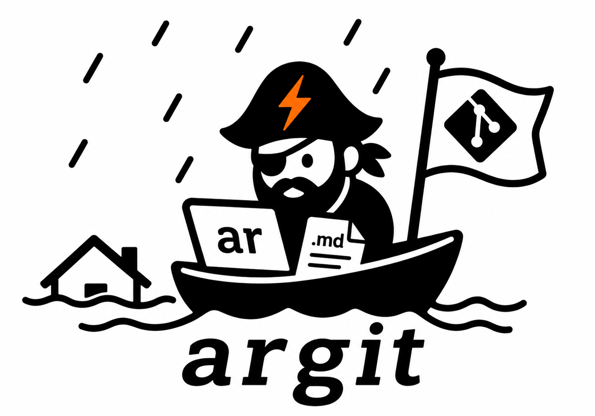

# argit — per-user agent backup & restore



`argit` is a standalone Python CLI that backs up and restores a per-user agent's
state into a git repository. Secrets live in a repo-local `pass` store (dual-recipient
encrypted with the operator's GPG key + an IT backup key); sanitized config and state
commit as plaintext. MVP targets **OpenClaw** only.

## Quick Install / Upgrade

```sh
uv tool install --force git+https://github.com/blinkbitcoin/argit.git@main
argit --version
```

Or with `pipx`:

```sh
pipx install --force git+https://github.com/blinkbitcoin/argit.git@main
```

The trailing ref — `main` — is any tag, branch, or SHA. Re-run the same command
to upgrade: with the same ref to pick up new commits, or with a different one
(`@v1`, `@v1.11.0`) to move releases.

There is also a bootstrap script (used in the six-step flow below) that picks
whichever of `uv` / `pipx` is present; it installs the `v1` tag by default,
overridable with `ARGIT_TAG`:

```sh
curl -fsSL https://raw.githubusercontent.com/blinkbitcoin/argit/main/install.sh | bash
```

If `argit` isn't on PATH after install, run `pipx ensurepath` and `source ~/.bashrc` (or `~/.zshrc`).

## Six-Step Bootstrap

```sh
curl -fsSL https://raw.githubusercontent.com/blinkbitcoin/argit/main/install.sh | bash
mkdir openclaw-backup && cd openclaw-backup && git init
argit setup                                              # copies manifest, .gitattributes, creates secrets/, runs pass init
argit backup
git add -A && git commit -m 'initial backup' && git push # or: argit backup --push on subsequent runs
```

## Commands

### `argit setup`

One-time (idempotent) bootstrapping inside an existing git-init'd repo. Copies the
bundled OpenClaw manifest, appends the git-lfs line to `.gitattributes`, creates
`secrets/`, imports the bundled IT backup public key (after interactive confirmation
unless `--yes`), and runs `pass init` with the agent key plus a backup recipient.
If `secrets/.gpg-id` already exists, setup respects that recipient list and skips
IT-key import and `pass init`.

Flags:

- `--yes` — skip the IT-key-import confirmation.
- `--agent-key <fpr>` — pick the operator's GPG fingerprint explicitly. **Required**
  when `gpg --list-keys` returns more than one non-IT key.
- `--it-recipient <fpr>` — greenfield-only backup/escrow recipient fingerprint.
  Defaults to the bundled IT-backup key. Ignored when `secrets/.gpg-id` exists.
- `--no-upgrade-manifest` — don't prompt for bundled-manifest upgrades; drift is
  still reported. Pin the in-repo revision and control upgrade timing yourself.
  Query the pinned-vs-bundled gap with `argit drift --json` (below).
- `--dry-run` — print actions without executing.

Argit treats `secrets/.gpg-id` as the encryption authority. During `backup` and
`restore`, argit's repo-scoped `pass` calls set `--trust-model always` so GPG
does not prompt on backup/escrow recipients in non-interactive runs. Use
`argit doctor` to verify every `.gpg-id` recipient public key is present before
running backups.

### `argit doctor`

Diagnostic-only status report. No mutations. Exits 0 if every check passed, 1 on
any failure. Each failed check prints the exact remediation command. Also previews
lifecycle commands declared in the manifest — useful for auditing what a restore
would execute.

### `argit info`

Prints argit's bundled-resource locations + metadata. Repo-independent and
dependency-free (never shells out to gpg), so it works identically under
`pipx`, `uv tool`, `pip --user`, and source installs — no need to
reconstruct install-layout-specific paths or `import argit` from a foreign
interpreter. Reports the package root, the IT-backup pubkey path, the
manifest-templates dir, the `hashes.json` catalog path, the declared
IT-backup fingerprint/uid, and the bundled manifest templates. Human mode
prints the manifest-template *count*; the full list is emitted only in
`--json` (under `manifest_templates`).

Flags:

- `--json` — emit a stable machine-readable object (for orchestrators/CI).

```bash
# locate the bundled IT pubkey regardless of install method
argit info --json | jq -r '.resources.it_backup_pubkey'
```

### `argit drift`

Reports whether the in-repo manifest matches the **currently selected bundled
manifest** — the machine-readable companion to `setup --no-upgrade-manifest`.
Read-only, non-mutating, and hash-only (no `load_manifest`, so a
grammar-incompatible manifest still classifies). **Always exits 0** for any
classified state — drift is a queryable condition, not a failure; only genuine
errors (agent-type mismatch, malformed catalog) exit non-zero.

`state` is one of `clean`, `stale_bundle` (an upgrade is available),
`operator_modified` (hand-edited — left alone; extensions belong in
`.manifest.local.json`), or `no_manifest`. The report compares the repo
manifest against the selected bundled one (not merely the latest revision
within the repo manifest's own version family), so a repo pinned to the newest
revision of an *older* version family is correctly reported as stale.
`revisions_behind` is an integer for same-family rev-bumps and `null` across
version families (revision numbers reset per family) — branch on
`upgrade_available` (a boolean) for a family-agnostic signal.

Flags:

- `--json` — emit one JSON-line object (drops into a JSON-lines event pipeline).
- `--agent-type <type>` — manifest family to classify against (default `openclaw`).

```bash
# pin the manifest at install, then monitor the fleet for drift
argit setup --yes --no-upgrade-manifest
argit drift --json
# {"schema":"argit.drift/v1","agent_type":"openclaw","manifest_file":"openclaw-2026.4.14-1.manifest.json",
#  "repo_agent_version":"2026.4.14","repo_revision":1,"state":"stale_bundle",
#  "bundled_manifest_file":"openclaw-2026.4.14-3.manifest.json","bundled_agent_version":"2026.4.14",
#  "bundled_revision":3,"revisions_behind":2,"upgrade_available":true}

# alert when an instance is behind (works across version families)
test "$(argit drift --json | jq -r .upgrade_available)" = "false" || open-tracking-issue
```

`argit doctor` also surfaces a (non-failing) `manifest drift` line for at-a-glance
checks; `argit drift --json` is the channel automation should parse.

### `argit backup`

Reads the manifest, extracts sanitized secrets to the repo-local pass store,
dumps SQLite DBs via `sqlite3 .backup`, copies data trees, syncs media via
git-lfs. Default is **write-only** (no git operations).

Flags:

- `--commit` — stage + commit managed paths (excluding the manifest file itself,
  `.argit/in-progress`, and `.argit/lock`).
- `--push` — implies `--commit`, then `git push`.
- `--strict` — fail hard on unspecified files in `source_root` (files not covered
  by any `items[]`, `sanitize[]`, or `exclude[]` rule).
- `--dry-run` — print actions without executing.

### `argit restore`

Reverses a backup. Re-injects secrets from pass, rehydrates the source tree,
runs the final verify phase (no `${pass:}` placeholders, every pass path
resolves, SQLite `PRAGMA integrity_check` is `ok`, modes match manifest).

Flags:

- `--target <dir>` — restore somewhere other than the manifest's `source_root`.
  **Always test against `/tmp/argit-scratch` first** before restoring over a live install.
- `--overwrite` — `rm -rf` the target first. **Destroys EVERY file in the target**,
  including ones the backup doesn't know about. Prompts unless `--yes`.
- `--merge` — overlay restored state; files already in target are preserved.
  Mutually exclusive with `--overwrite`.
- `--yes` — skip interactive confirmations.
- `--force` — skip the lifecycle running-check; restore proceeds even if the
  agent is live (loud warning).
- `--skip-lifecycle` — bypass `detect_running` / `stop` / `start` entirely.
- `--dry-run` — print actions without executing.

## Destructive-Restore Warning

`argit restore --overwrite` calls `shutil.rmtree(<target>)` before rehydrating.
If the target is your live `~/.openclaw/` and something outside the manifest lives
there (plugin state, operator-added notes, anything else), **it is gone**.

**Always dry-run first into a scratch dir**:

```sh
argit restore --target /tmp/argit-scratch --overwrite --yes
# inspect /tmp/argit-scratch; if correct, only then:
argit restore --overwrite
```

## Troubleshooting

### gpg-agent not caching the passphrase

If the first `argit backup` or `argit restore` hangs for 30s and then prints the
pinentry hint, gpg-agent hasn't cached your GPG passphrase. Prime it:

```sh
echo test | gpg --decrypt --armor --quiet --recipient <your-fpr> 2>/dev/null || gpg --edit-key <your-fpr> trust quit
```

Easier: run any `pass show <some-entry>` interactively once.

### Missing host binaries

argit errors include the exact install line. For reference:

- `pass`: `brew install pass` / `apt install pass`
- `gpg`: `brew install gnupg` / `apt install gnupg`
- `git-lfs`: `brew install git-lfs && git lfs install` / `apt install git-lfs && git lfs install`
- `sqlite3`: `brew install sqlite` / `apt install sqlite3`

### LFS pointer files after clone

If `argit restore` fails the verify phase with "git lfs pointer", the repo was
cloned without LFS content. Run:

```sh
git lfs pull
argit restore
```

### git push authentication fails

Two recommended setups:

1. **GitHub CLI**: `gh auth login` — handles HTTPS remotes out of the box.
2. **Personal SSH key**: set up GitHub with SSH as usual; `git push` Just Works.

Automated deploy-key setup (storing a per-repo deploy key in the pass store) is
out of MVP scope.

### `UnicodeEncodeError` mid-command (`LANG=C` containers)

argit's status output uses `✓ → ✗` characters. In containers without a UTF-8 locale,
Python defaults to ASCII and chokes. Fix:

```sh
export PYTHONIOENCODING=utf-8
# or set a locale: export LANG=C.UTF-8
```

### Running `argit restore` while OpenClaw is live

Default behavior: argit probes `lifecycle.detect_running`. If the agent is running
and `lifecycle.stop` is defined, argit stops it (polling `detect_running` up to 30s)
before restoring. Lifecycle commands are printed to stderr before execution so you
can audit what's about to run.

- `--force` — skip the stop phase; restore while the agent is live. Loud warning.
  **Corruption risk**: a live SQLite DB writer can interleave with the restore.
- `--skip-lifecycle` — skip probe + stop + start entirely. Manage the lifecycle
  yourself.

## Trust Boundary

argit lifecycle commands (`lifecycle.detect_running` / `.stop` / `.start`) execute
arbitrary shell in your user context. Install only from the official
`blinkbitcoin/argit` repo; never apply a manifest from an untrusted source.

argit's security model assumes:

1. Your local user environment is trusted.
2. You installed argit from the official `blinkbitcoin/argit` GitHub repo.
3. GPG-protected secrets in the backup repo are safe against attackers who do
   not have the private key.

argit does **not** defend against: push-access attackers tampering with
`lifecycle.*` commands in the repo-copy (mitigation: lifecycle argv is echoed to
stderr before exec, `argit doctor` previews commands, `--skip-lifecycle`
bypasses), supply-chain compromise of argit itself, or compromised GPG private
keys.

See [MANIFEST.md](MANIFEST.md) for design rationale and manifest authoring.

## License

MIT — see [LICENSE](LICENSE).
